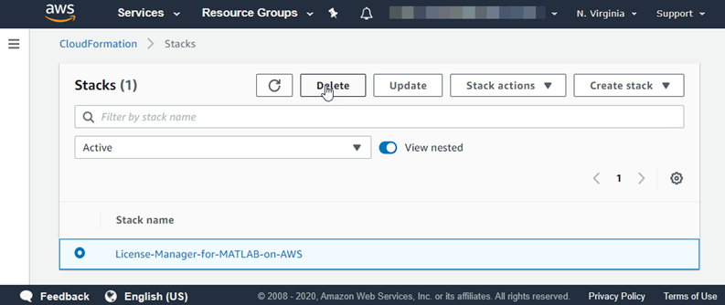

# Network License Manager for MATLAB on Amazon Web Services (Linux VM)

## Step 1. Launch the Template

Click the **Launch Stack** button below to deploy the cloud resources on AWS. This will open the AWS console in your web browser.

| Region | Launch Link |
| --------------- | ----------- |
| **us-east-1** |  |
| **us-east-2** |  |
| **us-west-1** |  |
| **us-west-2** |  |
| **ca-central-1** |  |
| **eu-central-1** |  |
| **eu-west-1** |  |
| **eu-west-2** |  |
| **eu-west-3** |  |
| **eu-north-1** |  |
| **sa-east-1** |  |
| **me-south-1** |  |
| **ap-east-1** |  |
| **ap-south-1** |  |
| **ap-northeast-1** |  |
| **ap-northeast-2** |  |
| **ap-southeast-1** |  |
| **ap-southeast-2** |  |

## Step 2. Configure the Cloud Resources
After you click the Launch Stack button above, the “Create stack” page will open in your browser where you can configure the parameters. It is easier to complete the steps if you position these instructions and the AWS console window side by side.

1. Specify a stack name. This will be shown in the AWS CloudFormation console and must be unique within the AWS account.

2. Specify and check the defaults for these resource parameters:

| Parameter label | Description |
| --------------- | ----------- |
| **VPC to deploy this stack to** | ID of an existing VPC in which to deploy this stack |
| **Subnet for the license server** | ID of an existing subnet for the license server |
| **CIDR IP address range of client** | The IP address range that will be allowed to connect to this server from outside of the VPC. This field should be formatted as \<ip_address>/\<mask>. E.g. 10.0.0.1/32. This is the public IP address which can be found by searching for 'what is my ip address' on the web. The mask determines the number of IP addresses to include. A mask of 32 is a single IP address. This calculator can be used to build a specific range: https://www.ipaddressguide.com/cidr. You may need to contact your IT administrator to determine which address is appropriate. |
| **Instance type for the network license manager** | The AWS instance type to use to run the Network License Manager for MATLAB. See https://aws.amazon.com/ec2/instance-types for a list of instance types. |
| **Name of SSH key** | The name of an existing EC2 KeyPair to allow SSH access to all the instances. See https://docs.aws.amazon.com/AWSEC2/latest/UserGuide/ec2-key-pairs.html for details on creating these. |
| **InstanceAmiCustom** | Custom Amazon Machine Image (AMI) in the target region |
| **Password** | Password for user 'manager'. This is used to login to the Network License Manager for MATLAB dashboard |
| **Confirm Password** | Confirm Password |

3. Click the **Create** button.

When you click Create, the license server is created using AWS CloudFormation templates.

# Step 3: Connect to the Dashboard
> **Note**: The Internet Explorer web browser is not supported for interacting with the cloud console.

1. In the Stack Detail for your stack, expand the **Outputs** section.
2. Look for the key named `ServerAddress` and click the corresponding URL listed under value. This is the HTTPS endpoint to the network license manager for MATLAB Dashboard.

# Step 4: Log in to the Dashboard

1. Enter the username `manager` along with the password for this user you created in Step 2.

> **Note**: The dashboard uses a self-signed certificate which can be changed. For information on changing the self-signed certificates, see [Change Self-signed Certificate](#change-self-signed-certificate).

# Step 5: Upload the License File
> **Note**: You will need the fixed MAC address created in the CloudFormation Stack to get a license file from the MathWorks License Center for your product. For more information see the documentation for your product.

1. In the cloud console, go to **Administration > Manage License**.
2. Click **Browse License File** to select the license file you want to upload and click **Open**.
3. Click **Upload**.

You are now ready to use the network license manager on AWS.

To configure your MATLAB products deployed in AWS to use the network license manager see the product documentation. An example for MATLAB Parallel Server can be found at [MATLAB Parallel Server on Amazon Web Services](https://github.com/mathworks-ref-arch/matlab-parallel-server-on-aws).

# Additional Information
## Delete Your Cloud Resources
You can remove the CloudFormation stack and all associated resources when you are done with them. Note that you cannot recover resources once they are deleted. After you delete the cloud resources you cannot use the downloaded profile again.

1. Select the Stack in the CloudFormation Stacks screen.  Select **Actions/Delete**.

     

2. Confirm the delete when prompted.  CloudFormation will now delete your resources which can take a few minutes.

## Change Self-signed Certificate
You can change the self-signed certificate used to connect to the dashboard. To upload an HTTPS certificate:
1. On the dashboard navigation menu, select **Administration** > **Manage HTTPS Certificate**.
1. Click **Browse Certificate...** and select a certificate file. Only `.pfx` files are supported.
1. Enter the certificate password in the **Certificate Password** field.
1. Click **Upload**.

The server will automatically restart after uploading a certificate. You will need to sign out and sign back in.

## Troubleshooting
If your stack fails to create, check the events section of the CloudFormation console. It will indicate which resources caused the failure and why.

If the stack created successfully but you are unable to access the dashboard check the logs on the instances to diagnose the error.

When using SSH to connect to the instance, login as `ubuntu`.

The logs are output to /var/log on the instance nodes; the files of interest are cloud-init.log, cloud-init-output.log, mathworks.log.